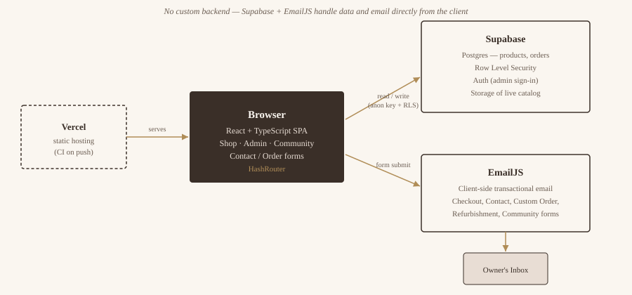

# Perrine — Handcrafted Bead Artistry

**[🔗 Live Demo](https://pincessis17-perrines-adornments-sto.vercel.app/)**


A full-stack e-commerce storefront for a handcrafted beaded bag/accessories brand, built with React, TypeScript, and Supabase. Live product catalog, cart, custom-order requests, refurbishment bookings, and a community lookbook, all backed by real form submissions and a live database.

## Features

- **Product catalog** — products are fetched live from Supabase and filterable by category (Bags, Belts, Accessories, Custom Orders)
- **Cart & checkout flow** — add items, review a cart drawer, and submit an order; the order is emailed via EmailJS and persisted to a Supabase `orders` table
- **Custom orders** — a request form (with reference-image upload and budget/timeline selectors) that emails the shop owner
- **Refurbishment requests** — a service-booking form for restoring existing pieces
- **Community lookbook** — a masonry gallery of customer looks with likeable posts, plus a "share your look" submission form
- **Admin bulk import** (`/admin`) — sign in as an admin and upload a CSV to bulk-create products; categories are picked up automatically from whatever's in the CSV's `category` column, so the Shop page's filters update without any code changes
- **Responsive, animated UI** — built on shadcn/ui + Radix primitives with Tailwind CSS

## Architecture



There's no custom backend — the React SPA talks directly to Supabase (data + auth, protected by Row Level Security) and to EmailJS (transactional email) from the client. Vercel serves the static build and rebuilds on every push to `main`.

## Tech Stack

- **Frontend:** React 18, TypeScript, Vite
- **Styling:** Tailwind CSS, shadcn/ui, Radix UI primitives
- **Routing:** React Router (`HashRouter`)
- **Data fetching:** TanStack Query
- **Backend/DB:** Supabase (Postgres + client SDK)
- **Email:** EmailJS (client-side transactional email, no custom backend needed)
- **Testing:** Vitest, Playwright
- **Deployment:** Vercel (`vercel.json` included for SPA rewrites)

## Getting Started

### Prerequisites

- Node.js 18+
- A [Supabase](https://supabase.com) project with a `products` table (columns: `id`, `name`, `price`, `image`, `category`) and an `orders` table (columns: `product`, `name`, `email`, `whatsapp`, `quantity`)
- An [EmailJS](https://emailjs.com) account with a service and template configured

### Setup

```bash
# install dependencies
npm install

# copy the env template and fill in your own keys
cp .env.example .env
```

Fill in `.env`:

```
VITE_SUPABASE_URL=your-supabase-project-url
VITE_SUPABASE_KEY=your-supabase-publishable-key
VITE_EMAILJS_SERVICE_ID=your-emailjs-service-id
VITE_EMAILJS_TEMPLATE_ID=your-emailjs-template-id
VITE_EMAILJS_PUBLIC_KEY=your-emailjs-public-key
```

### Run locally

```bash
npm run dev       # start dev server (http://localhost:8080)
npm run build     # production build
npm run test      # run unit tests (Vitest)
```

## Project Structure

```
src/
├── pages/           # route-level views (Shop, About, Contact, CustomOrders, Refurbishment, Community)
├── components/      # shared components (Navbar, Footer, FloatingBeads) + shadcn/ui primitives
├── hooks/           # custom hooks (use-toast, use-mobile)
├── lib/             # Supabase client, utility helpers
└── assets/          # product and brand imagery
```

## Notes

- All customer-facing forms (Contact, Custom Orders, Refurbishment, Community share) send through EmailJS using environment-configured credentials — none are just cosmetic/local-state toasts.
- Supabase's *publishable* key is safe to expose client-side by design (paired with Row Level Security policies on the backend); it is still kept out of source control via `.env`.

## Bulk Product Import

`/admin` is a CSV importer restricted to signed-in admins.

1. Create yourself an admin account in the Supabase dashboard: **Authentication → Users → Add user**.
2. Go to `/admin` on the running app and sign in with that account.
3. Upload a CSV with columns: `name`, `category`, `price`, and optionally `image` (a URL — if omitted, a placeholder image is used). A template is included at `sample-products.csv`.
4. Rows are validated client-side (missing name/category, invalid price) and shown in a preview with a per-row pass/fail before anything is written.
5. Products are grouped into categories automatically — whatever string is in the `category` column becomes a filter option on the Shop page, with no code changes required.

This is enforced with a Postgres RLS policy: only `authenticated` users can insert into `products`; anonymous visitors can still read the catalog but not modify it.

## Database Schema

The full schema (tables + Row Level Security policies) is versioned as SQL under `supabase/migrations/`, so the backend is reproducible from the repo alone — not dependent on the live project's current state. To spin up your own instance:

```bash
# with the Supabase CLI, pointed at your own project
supabase db push
```

or run the files in `supabase/migrations/` manually in the Supabase SQL editor, in order.

